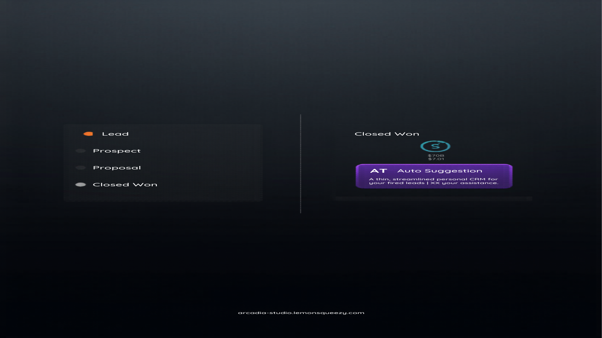

# Arcadia Connect

A personal CRM layer for Obsidian. Link people across your notes with @-mentions, log interactions, visualize a deal pipeline, and get AI-powered follow-up suggestions — all without leaving your vault.


---

## Features

### Free (All Users)

| Feature | Description |
|---|---|
| @-mention autocomplete | Type `@` in any note to link a person. Live dropdown, CodeMirror 6 |
| People Panel | Searchable sidebar listing all contacts with sort options |
| Hover profile cards | Mini card pops up on @-mention hover in reading view |
| Person note creation | Create structured contact notes from the panel or command palette |
| Interaction logging | Log calls, emails, meetings, and notes directly to contact notes |
| Follow-up reminders | Hourly check with Obsidian notices for overdue and due-today follow-ups |
| Timeline view | Chronological feed of all interactions across every contact |
| Pipeline / Deal board | Kanban board by deal stage with deal value totals and move-stage controls |
| AI follow-up suggestions | BYOK: bring your Anthropic or OpenAI key for AI-powered next-action suggestions |

### Premium

Premium features require a license key from [arcadia-studio.lemonsqueezy.com](https://arcadia-studio.lemonsqueezy.com).

| Feature | Description |
|---|---|
| Advanced analytics | Relationship health scores, contact frequency charts |
| CSV import / export | Bulk-load contacts from any CRM or spreadsheet |
| Organization views | Group contacts by company with org-level deal tracking |
| Birthday and date reminders | Configurable alerts for key relationship dates |
| Expanded profile sidebar | Full relationship metadata, tags, and relationship history |

---

## Screenshots



---

## Installation

### From Obsidian Community Plugins (Recommended)

1. Open Obsidian Settings
2. Go to **Community Plugins** and disable Safe Mode
3. Click **Browse** and search for **Arcadia Connect**
4. Click **Install**, then **Enable**

### Manual Installation

1. Download `main.js`, `manifest.json`, and `styles.css` from the [latest release](https://github.com/Arcadia-Studio/obsidian-arcadia-connect/releases/latest)
2. Create the folder `.obsidian/plugins/arcadia-connect/` in your vault
3. Copy the three files into that folder
4. Open Obsidian Settings → Community Plugins → enable **Arcadia Connect**

---

## Quick Start

### 1. Configure Your People Folder

Settings → Arcadia Connect → **People folder** — set the path where contact notes will be stored (e.g., `People/`).

### 2. Create Your First Contact

- Click the 👤 ribbon icon to open the People Panel → **+ New**
- Or: Command palette → **Create Person Note**

Each contact note uses structured frontmatter:

```yaml
file-role: crm-contact
last-contact: 2026-03-30
next-follow-up: 2026-04-15
follow-up-status: pending
deal-stage: prospect
deal-value: 5000
organization: Acme Corp
role: VP of Sales
email: contact@example.com
```

### 3. Mention People in Notes

Type `@` in any note to trigger the autocomplete. Select a name to insert an internal link. In reading view, mentions render as clickable links with a hover profile card.

### 4. Log Interactions

- Hover any contact in the People Panel → **+ Log**
- Or: Command palette → **Log Interaction**
- Or: Click **+ Log** on any Pipeline card

Choose interaction type (Call, Email, Meeting, Note), write a summary, and optionally set the next follow-up date. The entry is appended to the contact's `## Interaction Log` section and `last-contact` is updated automatically.

### 5. Timeline View

Click the 🕐 ribbon icon. All interactions across all contacts, newest first, bucketed by Today / Yesterday / This Week / This Month / Earlier. Filter by contact name using the search box.

### 6. Pipeline View

Click the ⬛ ribbon icon. Contacts are grouped into 6 Kanban columns by `deal-stage`:

- **Lead → Prospect → Proposal → Negotiation → Closed Won → Closed Lost**

Each column shows total deal value. On each card, use the **Move to...** dropdown to change stage (updates frontmatter instantly), or **+ Log** to record an interaction.

### 7. AI Follow-Up Suggestions

1. Settings → Arcadia Connect → **AI Enrichment** — add your Anthropic or OpenAI API key
2. Open any contact note
3. Command palette → **AI: Suggest Follow-up for Active Contact**

The AI reads the contact's profile and last 20 interaction log entries, then returns a suggested action, reasoning, and optional draft message. Hit **Append to note** to save the suggestion directly to the contact file.

Keys are stored locally in your vault settings and are never sent to Arcadia servers. You call the AI provider directly.

---

## CRM Frontmatter Reference

| Field | Values | Description |
|---|---|---|
| `file-role` | `crm-contact` | Marks the note as a contact |
| `last-contact` | `YYYY-MM-DD` | Date of most recent interaction |
| `next-follow-up` | `YYYY-MM-DD` | Scheduled follow-up date |
| `follow-up-status` | `pending` / `done` / `snoozed` | Follow-up state |
| `deal-stage` | `lead` / `prospect` / `proposal` / `negotiation` / `closed-won` / `closed-lost` | Pipeline stage |
| `deal-value` | number | Deal value in dollars |
| `organization` | string | Company or organization name |
| `role` | string | Job title or role |
| `email` | string | Email address |
| `phone` | string | Phone number |
| `tags` | list | Obsidian tags |

---

## Premium License

Enter your license key at **Settings → Arcadia Connect → License key** and click **Validate**.

Get a license at [arcadia-studio.lemonsqueezy.com](https://arcadia-studio.lemonsqueezy.com).

---

## Commands

| Command | Description |
|---|---|
| Open People Panel | Open the contacts sidebar |
| Create Person Note | Create a new contact note |
| Mention Person | Insert `@` trigger to activate autocomplete |
| Open Interaction Timeline | Open the timeline view |
| Open Deal Pipeline | Open the Kanban pipeline |
| Log Interaction | Open the interaction logger |
| AI: Suggest Follow-up for Active Contact | Run AI analysis on the open contact note |

---

## Development

```bash
git clone https://github.com/Arcadia-Studio/obsidian-arcadia-connect.git
cd obsidian-arcadia-connect
npm install
npm run dev        # watch mode
npm run build      # production build
npx tsc --noEmit   # typecheck
```

---

## About Arcadia Studio

Arcadia Studio builds productivity tools for the Obsidian ecosystem.

[arcadia-studio.lemonsqueezy.com](https://arcadia-studio.lemonsqueezy.com) · [GitHub](https://github.com/Arcadia-Studio)
